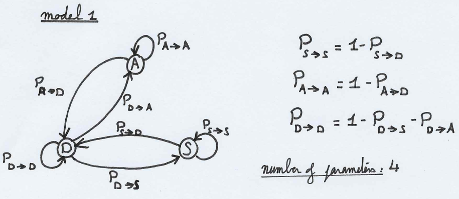

```{r setup, include=FALSE}
knitr::opts_chunk$set(echo = TRUE)
```

<hr>

## Question 1 - Maximum likelihood for Markov chain 

Given a cognitive context of sleeping patterns, a check is performed every five minutes on study participants and their state is noted. We want to model this by a (discrete) Markov chain with 3 states:
- "sleeping"
- "(fully) awake"
- "drowsy"

**Step A** -- Plot the diagrams and parametrize the two following (informal) models with the least
possible amount of parameters
- You can only pass from "fully awake" to "sleeping" through the state "drowsy" and
vice-versa: you can only go from sleeping to "fully awake" through "drowsy".
- It is possible (but not necessary) to be instantly awake or instantly sleeping and to
skip the "drowsy" state.

**Step B** -- Make a function in R which simulates the first model if you give in entries the state $x_0$,
the parameters of the model (only the ones parametrizing the transitions) and the length of the chain to simulate $n$.

**Step C** -- Write the (log)-likelihood of this problem and give the maximum likelihood estimator of $P_{D\rightarrow S}$, the probabilty to fall asleep when you are drowsy. Would it be different if we were in the second model?

**Step D** -- Show on simulation that this estimator converges towards the true probability when n tends to infinity.

**Step E** -- How would you decide if we are in the first or second model when you have the observations?

### STEP A

The first model is defined as in picture 1 attached, with a **minimum of four parameters** such that:

\begin{align}
\text{parameter space}&\text{:}\quad\{P_{A\rightarrow D},P_{S\rightarrow D},P_{D\rightarrow A},P_{D\rightarrow S})\}\\
P_{A\rightarrow A}&=1-P_{A\rightarrow D}\\
P_{S\rightarrow S}&=1-P_{S\rightarrow D}\\
P_{D\rightarrow D}&=1-P_{D\rightarrow A}-P_{D\rightarrow S}\\
\end{align}

With $A$ the "awake" state, $S$ the "sleeping" state, and $D$ the "drowsy" state.

**Of note**, if the selection of the state at time $T=0$ (i.e. the start state) is also random, we have to add 2 more parameters: $P(x_0=A)$ and $P(x_0=S)$ such that $P(x_0=D)=1-P(x_0=A)-P(x_0=S)$. As such, it would bring model 1's **number of parameters to six**.



The second model is defined as in picture 2 attached, with a **minimum of six parameters** such that:

\begin{align}
\text{parameter space}&\text{:}\quad\{P_{A\rightarrow D},P_{A\rightarrow S},P_{S\rightarrow D},P_{S\rightarrow A},P_{D\rightarrow A},P_{D\rightarrow S})\}\\
P_{A\rightarrow A}&=1-P_{A\rightarrow D}\\
P_{S\rightarrow S}&=1-P_{S\rightarrow D}\\
P_{D\rightarrow D}&=1-P_{D\rightarrow A}-P_{D\rightarrow S}\\
\end{align}

**Of note**, if the selection of the state at time $T=0$ (i.e. the start state) is also random, we have to add 2 more parameters: $P(x_0=A)$ and $P(x_0=S)$ such that $P(x_0=D)=1-P(x_0=A)-P(x_0=S)$. As such, it would bring model 2's **number of parameters to eight**.


### STEP B

```{r generate_model_1}

compute_jump <- function(state, p_AtoD, p_StoD, p_DtoS, p_DtoA){
  ### Computes the next jump
  if (state == "A"){
    draw = rbinom(1, 1, p_AtoD)
    if (draw == 1){
      return("D")
    } else {
      return("A")
    }
  }
  if (state == "S") {
    draw = rbinom(1, 1, p_StoD)
    if (draw == 1){
      return("D")
    } else {
      return("S")
    }
  }
  # Else (State is drowsy)
  draw = runif(1, 0, 1)
  if (draw < p_DtoS){
      return("S")
    } else if (draw < p_DtoS + p_DtoA) {
      return("A")
    } else {
      return("D")
    }
}

generate_process_from_model1 <- function(x0, n, p_AtoD, p_StoD, p_DtoS, p_DtoA){
  ### Generates a process given the model 1 previously discribed
  ### x0: start state, p_AtoD: jump probability from A to D, 
  ### p_StoD: jump probability from S to D, n: process length
  if (!x0 %in% c("A","S","D")) {
    print("Wrong input for entry state x0")
    return(0)
  }
  process = c(x0)
  for (step in c(1:n)) {
    x0 = compute_jump(x0, p_AtoD, p_StoD, p_DtoS, p_DtoA)
    process = c(process, x0)
  }
  return(process)
}

```

We produce a couple examples:

```{r generated_model1_example1}

p_AtoD = 0.4
p_StoD = 0.2
p_DtoS = 0.4 
p_DtoA = 0.4
generate_process_from_model1("A", 50, p_AtoD, p_StoD, p_DtoS, p_DtoA)
generate_process_from_model1("S", 50, p_AtoD, p_StoD, p_DtoS, p_DtoA)
generate_process_from_model1("D", 50, p_AtoD, p_StoD, p_DtoS, p_DtoA)

```

### STEP C

Given the parameter space $\theta=\{P_{A\rightarrow D},P_{S\rightarrow D},P_{D\rightarrow A},P_{D\rightarrow S})\}$, for a given $n$-length realization of the model 1's process $x_0, ..., x_n$ is given by:

\begin{align}
P_\theta((X_0, ..., X_n)&=(x_0, ..., x_n))\\
&=P_\theta(X_0=x_0, ..., X_n=x_n)\\
&=P_\theta(X_0=x_0).P_\theta(X_1=x_1|X_0=x_0).\,...\,.P_\theta(X_n=x_n, ..., X_{n-1}=x_{n-1})\\
\end{align}

Given this setup, and including the parameters $P(x_0=A)$ and $P(x_0=S)$ such that $P(x_0=D)=1-P(x_0=A)-P(x_0=S)$ as noted in Step B, we can rewrite $P_\theta(X_0=x_0, ..., X_n=x_n)$ such that:

\begin{align}
P_\theta(X_0=x_0, ..., X_n=x_n)&=P(x_0=A)^{\mathbb{1}_{x_0=A}}.P(x_0=S)^{\mathbb{1}_{x_0=S}}.(1-P(x_0=A)-P(x_0=S))^{\mathbb{1}_{x_0=D}}\\&.P_{A\rightarrow A}^{n_{A\rightarrow A}}.P_{S\rightarrow S}^{n_{S\rightarrow AS}}.P_{D\rightarrow D}^{n_{D\rightarrow D}}.P_{A\rightarrow D}^{n_{A\rightarrow D}}.P_{S\rightarrow D}^{n_{S\rightarrow D}}.P_{D\rightarrow A}^{n_{D\rightarrow A}}.P_{D\rightarrow S}^{n_{D\rightarrow S}}\\
\end{align}

so, the likelihood of a Model 1 sequence $X_0, ..., X_n$ with counts $n_{i\rightarrow j}$ (the number of times a transition from state $i$ to state $j$ has occured in the sequence) is given by:

\begin{align}
L_\theta(X)&=P(x_0=A)^{\mathbb{1}_{x_0=A}}.P(x_0=S)^{\mathbb{1}_{x_0=S}}.(1-P(x_0=A)-P(x_0=S))^{\mathbb{1}_{x_0=D}}\\&.(1-P_{A\rightarrow D})^{n_{A\rightarrow A}}.(1-P_{S\rightarrow D})^{n_{S\rightarrow AS}}.(1-P_{D\rightarrow A}-P_{D\rightarrow S})^{n_{D\rightarrow D}}\\&.P_{A\rightarrow D}^{n_{A\rightarrow D}}.P_{S\rightarrow D}^{n_{S\rightarrow D}}.P_{D\rightarrow A}^{n_{D\rightarrow A}}.P_{D\rightarrow S}^{n_{D\rightarrow S}}\\
\end{align}

the respective log-likelihood becomes:

\begin{align}
l_\theta(X)&=\mathbb{1}_{x_0=A}.log(P(x_0=A)) + \mathbb{1}_{x_0=S}.log(P(x_0=S)) + \mathbb{1}_{x_0=D}.log(1-P(x_0=A)-P(x_0=S))\\&+n_{A\rightarrow A}.log(1-P_{A\rightarrow D})+n_{S\rightarrow AS}.log(1-P_{S\rightarrow D})+n_{D\rightarrow D}.log(1-P_{D\rightarrow A}-P_{D\rightarrow S})\\&+n_{A\rightarrow D}.log(P_{A\rightarrow D})+n_{S\rightarrow D}.log(P_{S\rightarrow D})+n_{D\rightarrow A}.log(P_{D\rightarrow A})+n_{D\rightarrow S}.log(P_{D\rightarrow S})\\
\end{align}

Inspired from [here](https://www.stat.cmu.edu/~cshalizi/dst/20/lectures/19/lecture-19.html#(5)), we can rearrange the log-likelihood for simplicity:

\begin{align}
l_\theta(X)&=log(P(X_0=x_0))+\overset{n-1}{\underset{t=0}{\sum}}log(P_{x_{t}\rightarrow x_{t+1}})\\
&\equiv \overset{n-1}{\underset{t=0}{\sum}}log(P_{x_{t}\rightarrow x_{t+1}})\quad\text{(Conditioned on the initial state $x_0$)}\\
&\equiv -\frac{1}{n}\overset{n-1}{\underset{t=0}{\sum}}log(P_{x_{t}\rightarrow x_{t+1}})\quad\text{(Normalized, and signed for minimization purposes)}\\
\end{align}

We defined $N_{i\rightarrow j}$ the number of times the state $j$ follows the state $i$ in a given process. As such:

\begin{align}
N_i &= \sum_j N_{i\rightarrow j}\\
n &= \sum_i N_i\\
l_\theta(X)&\equiv-\frac{1}{n}\overset{n-1}{\underset{t=0}{\sum}}log(P_{x_{t}\rightarrow x_{t+1}})=-\frac{1}{n}\underset{i, j}{\sum}N_{i\rightarrow j}log(P_{i\rightarrow j})\quad\text{(sum over time vs. sum over state pairs)}
\end{align}

We are now interested in the maximum likelihood estimator (MLE) of the transition $i'\rightarrow j'$.

\begin{align}
\frac{\delta}{\delta P_{i'\rightarrow j'}}l_\theta(X)\equiv&-\frac{N_{i'\rightarrow j'}}{n}.\frac{1}{P_{i'\rightarrow j'}}
\end{align}

With $n$, the number of times the sequence was in state $i'$.

We want to minimize the above formula. As such we find that the simplest answer is:

$$\hat{P}_{i'\rightarrow j'}=\frac{N_{i'\rightarrow j'}}{n}$$

With $n$, the number of times the sequence was in state $i'$.

<u>Maximum likelihood estimator of $P_{D\rightarrow S}$ for model 1:</u>

Given the agnostic formula above, we find that:

$$\hat{P}_{D\rightarrow S}=\frac{N_{D\rightarrow S}}{n_D}$$
With $n_D$, the number of times the sequence was in state $D$.

<u>Maximum likelihood estimator of $P_{D\rightarrow S}$ for model 2:</u>

Given that the above formula is agnostic to the different possible transitions except the one being estimated (i.e. $i'\rightarrow j'$, and in our more specific cases of model 1 and 2: $D\rightarrow S$), the formula would remain unchanged. As such:

$$\hat{P}^{model\,1}_{D\rightarrow S}=\hat{P}^{model\,2}_{D\rightarrow S}=\frac{N_{D\rightarrow S}}{n_D}$$
With $n_D$, the number of times the sequence was in state $D$.

### STEP D

We declare our function computing the estimator as stated above.

```{r MLE_estimator}

compute_estimator <- function(sequence, start_state, end_state){
  ### Computes the MLE estimator of the transition probability between
  ### <start_state> and <end_state>. 
  # Computes all transitions in the sequence
  transitions = c()
  for (i in 1:(length(sequence)-1)){
    transitions = cbind(transitions, paste(sequence[i], "-", sequence[i+1]))
  }
  counter = table(transitions)
  # Computes the number of occurences of target transition
  transition_to_check = paste(start_state, "-", end_state)
  n_transition = counter[names(counter)==transition_to_check][[1]]
  # Returns the estimator
  n = sum(counter[substr(names(counter),1,1)==start_state])
  return(round(n_transition/n, 3))
}

```

We now try to compute the estimator convergence for a given transition on model 1, reusing the parameters previously declared in Step B, with an increasing length for the sequence.

We check for the transitions:

\begin{align}
P_{A\rightarrow D} &= 0.4\\
P_{S\rightarrow D} &= 0.2\\
P_{D\rightarrow S} &= 0.4\\
P_{D\rightarrow A} &= 0.4\\
P_{D\rightarrow D} &= 1-P_{D\rightarrow S}-P_{D\rightarrow A}=0.2\\
P_{A\rightarrow A} &= 1 - P_{A\rightarrow D} = 0.6\\
P_{S\rightarrow S} &= 1 - P_{S\rightarrow D} = 0.8\\
\end{align}

```{r MLE_estimator_convergence}

for (n in c(50, 100, 500, 1000, 5000, 10000)) {
  sequence = generate_process_from_model1("A", n, p_AtoD, p_StoD, p_DtoS, p_DtoA)
  cat("== Computing the MLE estimator with n =", n, "==\n")
  pAD = compute_estimator(sequence, "A","D")
  pSD = compute_estimator(sequence, "S","D")
  pDS = compute_estimator(sequence, "D","S")
  pDA = compute_estimator(sequence, "D","A")
  pDD = compute_estimator(sequence, "D","D")
  pAA = compute_estimator(sequence, "A","A")
  pSS = compute_estimator(sequence, "S","S")
  cat(paste("\tReal Probability\tMLE estimator\n"))
  cat(paste("P_AtoD:\t", p_AtoD, "\t\t\t", pAD, "\n"))
  cat(paste("P_StoD:\t", p_StoD, "\t\t\t", pSD, "\n"))
  cat(paste("P_DtoS:\t", p_DtoS, "\t\t\t", pDS, "\n"))
  cat(paste("P_DtoA:\t", p_DtoA, "\t\t\t", pDA, "\n"))
  cat(paste("P_DtoD:\t", 1-p_DtoS-p_DtoA, "\t\t\t", pDD, "\n"))
  cat(paste("P_AtoA:\t", 1-p_AtoD, "\t\t\t", pAA, "\n"))
  cat(paste("P_StoS:\t", 1-p_StoD, "\t\t\t", pSS, "\n\n\n"))
}

```

We empirically (via simulation) evidence that there is convergence.

We can also plot the convergence as such:

```{r}

# Declares probabilities
pAD=0.3
pDS=0.3
pDA=0.6
pSD=0.3 
p=c(pAD,pDS,pDA,pSD)

# Declares the point process model 1
Sleep_model <- function(x0,p,n) {
  pAD=p[1]
  pDS=p[2]
  pDA=p[3]
  pSD=p[4]
  X=rep(0,n)
  before=x0
  for (i in 1:n) {
    # Draws a uniform RV
    U=runif(1)
    # Checks state jump if currently at Awake
    if (before=='A') {
      if(U<pAD) {
        X[i]='D'
      } else {
        X[i]='A'
      }
    }  
    # Checks state jump if currently at Drowsy
    if (before=='D') {
      if(U<pDS) {
        X[i]='S'
      } else {
        if((U>pDS)&(U<(pDS+pDA))) {
          X[i]='A'
        } else {
          X[i]='D'
        }  
      }
    }
    # Checks state jump if currently at Asleep
    if (before=='S') {
      if(U<pSD) {
        X[i]='D'
      } else {
        X[i]='S'
      }
    } 
    before=X[i]
  }
  return(X)
}

# Declares the MLE computation function
MLE <- function(X) {
  before=X[1]
  n=length(X)
  countDS=0
  countD=0
  for(i in 2:n) {
    if (before=='D') {
      countD=countD+1
      if(X[i]=='S') {
        countDS=countDS+1
      }
    }
    before=X[i]
  }
  MLE=countDS/countD
  return(MLE)
}

# Draws a process
n_simulations = 5000
X=Sleep_model('A', p, n_simulations)

estimator = rep(0,n_simulations-1)

for(j in 2:n_simulations) {
  Xtrunc=X[1:j]
  estimator[j-1] = MLE(Xtrunc)
}

plot(1:length(estimator), estimator,
     type='l',ylab='MLE',xlab='n',
     main='Convergence of the estimator')
abline(h=pDS,col='red')

```

### STEP E

We would look for transition between states "A" and "S" or "S" and "A", which can only exist in model 2. However this implies that we would have collected enough observations to find those as, depending on the probabilities $P_{A\rightarrow S}$ and $P_{S\rightarrow A}$, as such transitions may not appear when the length of a generated sequence is low.

<hr>

## Question 2 - Maximum likelihood for Poisson processes

We are observing an inhomogeneous Poisson process with intensity $\lambda_0(.)$ on $[0, T_{max}]$. We want
to estimate $\lambda_0(.)$ by a piecewise constant function on a regular partition, which means that the
candidate intensities $\lambda(.)$ are, for a certain integer $d$ giving the number of bins, of the form:

$$\lambda(t)=\underset{i=1}{\overset{d}{\sum}}a^d_i\mathbb{1}_{b_{i-1}^d\le t<b^d_i}$$
With $b_i^d=\frac{i.T_{max}}{d}$

**Step A** -- When $d = 1$, write the likelihood of the process and provide the maximum likelihood estimator of $a^1_1$. Implement it and show on simulation that when $T_{max}$ grows, the estimation is converging when the process is homogeneous.

**Step B** -- For a more general $d$ write the corresponding likelihood and give the maximum likelihood estimator of the different $a^d_i$.

**Step C** -- Simulate by thinning a Poisson process of intensity $ne^{−x}$ and $n(1 + sin(x))$ on $[0, T_{max}]$ for various $n$. Superpose different MLE of the intensities for various choices of $d$ and $n$.

**Step D** -- Apply AIC criterion to select for a given observed Poisson process a good $d$.

**Step E** -- Apply it on the data of the STAR package, for instance the data citronellal (after having aggregated all the trials into just one point process).

### STEP A

We observe $N$ a Poisson process with conditional intensity:

\begin{align}
\lambda(t)&=\underset{i=1}{\overset{d}{\sum}}a^d_i\mathbb{1}_{b_{i-1}^d\le t<b^d_i}\\
&=a^1_1\quad\text{(When $d=1$)}
\end{align}

As such, we define the log-likelihood as:

\begin{align}
l_\lambda(N)&=\int_0^{T_{max}}log(\lambda(t))dN_t - \int_0^{T_{max}}\lambda(t)dt\\
&=log(a^1_1).N_{[0,T_{max}]}-a^1_1.T_{max}\\
\end{align}

With $N_{[0, T_{max}]}$ the number of points in the bin $d$, i.e., in between 0 and $T_{max}$.

We find the following **log-likelihood**:

\begin{align}
\frac{\delta}{\delta a^1_1}l_\lambda&=\frac{1}{a^1_1}.N_{[0,T_{max}]}-T_{max}\\
&\Rightarrow \hat{a}^1_1=\frac{N_{[0, T_{max}]}}{T_{max}}
\end{align}

From this, we can simulate the process and compute the resulting estimation:

```{r simulation_poisson_process, out.width="100%"}

simulate_a11 <- function(a11, maximum_seconds){
  # Simulates a poisson process with a11 fixed (i.e. homogeneous)
  draws = c()
  maxT = 0
  while (maxT < maximum_seconds) {
    draw = rexp(1, a11)
    maxT = maxT + draw
    draws = c(draws, draw)
  }
  poisson_process = cumsum(draws)
  # Computes the estimator for a growing [0, T] window
  estimators = c()
  for (i in 1:maximum_seconds){
    n_0Tmax = length(poisson_process[poisson_process<i])
    estimators = c(estimators, (n_0Tmax/i))
  }
  plot(x=c(1:maximum_seconds), estimators, type="l", 
       main=paste("Convergence of the MLE estimator of a^1_1=",a11,"\ngiven a",
                  maximum_seconds, "-second-long process", sep=""),
       xlab="Tmax used for estimation", ylab="MLE Estimator Value")
  abline(h=a11, col="red")
  return(list("process"=poisson_process, "estimators"=estimators))
}

# We provide 3 example rates over a maximum span of time of 1 hour
a11 = 1
simulation1 = simulate_a11(a11, 3600)
  
a11 = 0.1
simulation1 = simulate_a11(a11, 3600)

a11= 10
simulation1 = simulate_a11(a11, 3600)

```

We demonstrate convergence of the estimator via simulation. And since the convergence is towards a single value, and given that if an intensity $\lambda$ is constant then the underlying Poisson process is homogeneous, we can conclude that the estimation is converging when the process is homogeneous.

### STEP B

\begin{align}
\lambda(t)&=\underset{i=1}{\overset{d}{\sum}}a^d_i\mathbb{1}_{b_{i-1}^d\le t<b^d_i}\\
l_\lambda(N)&=\int_0^{T_{max}}log(\lambda(t))dN_t - \int_0^{T_{max}}\lambda(t)dt\\
&=\underset{i=1}{\overset{d}{\sum}}log(d_i^d)N_{[b^d_{i-1}, b^d_i]}\\
&=\underset{i=1}{\overset{d}{\sum}}log(d_i^d)N_{[\frac{(i-1)T_{max}}{d}, \frac{iT_{max}}{d}]}-a_i^d\frac{T_{max}}{d}\\
\frac{\delta}{\delta a_i^d}l_\lambda(N)&=\frac{N_{[\frac{(i-1)T_{max}}{d}, \frac{iT_{max}}{d}]}}{a_i^d}-\frac{T_{max}}{d}
\end{align}

As such we find that for a given $d$ number of bins and $i$ bin, we have the MLE estimator of $a_i^d$:

$$\hat{a}_i^d=\frac{d.N_{[\frac{(i-1)T_{max}}{d}, \frac{iT_{max}}{d}]}}{T_{max}}$$

Given $b_i^d=\frac{iT_{max}}{d}$, we can rewrite $\hat{a}_i^d$ as:

$$\hat{a}_i^d=\frac{N_{[b_{i-1}^d, b_i^d]}}{T_{max}/d}$$

### STEP C

We start by declaring our rate function and their integrals.

```{r rate_function, out.width="100%"}

rate_function_1 <- function(n, t){
  n*exp(-t)
}

rate_function_2 <- function(n, t){
  n*(1+sin(t))
}

example_n = 2
x = matrix(seq(1:400)/100)
rf1_y = apply(x, 1, function(x){rate_function_1(example_n,x)})
rf2_y = apply(x, 1, function(x){rate_function_2(example_n,x)})

plot(x, rf1_y, type="l", main=paste("Plot of intensity n*exp(-x)\n",
                                    "on interval [0,4] with n=2"),
     xlab = "Time", ylab="Intensity")
plot(x, rf2_y, type="l", main=paste("Plot of intensity n(1-sin(x))\n",
                                    "on interval [0,4] with n=2"),
     xlab = "Time", ylab="Intensity")

```

We determine that the intensity $\lambda(t)=n*e^{-t}$ is upper-bounded by $N$, we call this upper bound $M_1=n$. We also determine that the intensity $\lambda(t)=n*(1-sin(t))$ is upper-bounded by $N*2$. We call this upper bound $M_2=n*2$. We will use $M_1$ and $M_2$ for our thinning process.

We start with declaring our simulation functions (with thinning process) and MLE_estimator computation function.

```{r thinning_process}

simulate_on_1_interval <- function(n, a, b, M, rate_function) {
  ### Simulate a counting process on a given interval of a Poisson process
  draws = c()
  while (a <= b) {
    # Draws an Exponential random variable
    draw = rexp(1, M)
    a = a+draw
    # Draws a Uniform random variable
    bern = runif(1, 0, M)
    # Checks if the generated point falls below the rate function
    # and keeps it if so
    # records the draw if need be
    if (bern <= rate_function(n, a)){#} && a<=b){
      draws = c(draws, a)
    }
  }
  # Returns the draws
  draws
}

poisson_process_thinning_simulation <- function(n, d, Tmax, M, rate_function) {
  ### Simulate a Poisson process via thinning
  bin_size = Tmax/d
  a = 0
  draws = c()
  bins = c()
  MLE = c()
  while (a<Tmax){
    if (a+bin_size > Tmax){
      upper = Tmax
    } else {
      upper = a + bin_size
    }
    # Draws the Poisson process a hundred times on each given interval
    length_draw = 0
    for (i in 1:100){
      new_draws = simulate_on_1_interval(n, a, upper, M, rate_function)
      draws = c(draws, new_draws)
      length_draw = length_draw + length(new_draws)
    }
    MLE = c(MLE, length_draw/(bin_size*100))
    bins = c(bins, a)
    a = a+bin_size
  }
  # Returns the draws
  return(list(
    "n"=n,
    "d"=d,
    "draws"=draws, 
    "MLE_estimator_a"=MLE,
    "bins"=bins
    )
  )
}

plot_estimator <- function(
  n, d_range, Tmax, M, 
  discretization_factor,
  rate_function, 
  title
) {
  ### Plots the computed estimators given a value n and a range of d values
  ### a M value for the intensity function/rate function
  i = length(d_range)+1
  colors = c(2:(length(d_range)+2))
  x = matrix(seq(1:(Tmax*discretization_factor))/discretization_factor)
  rf = apply(x, 1, function(x){rate_function(n,x)})
  plot(x, rf, type="l", main=title, ylim=c(0,M*1.5))
  for (d in d_range) {
    i = i - 1
    pp = poisson_process_thinning_simulation(
      n, d, Tmax, M, rate_function
    )
    y = apply(x, 1, function(x){
      if (d == 1){
        pp$MLE_estimator_a
        } else {
          pp$MLE_estimator_a[d-length(pp$bins[pp$bins>=x])]
        }
    })
    lines(x, y, col=colors[abs(i-length(d_range))+1])
    legend(
      x="topright",
      legend=apply(matrix(d_range),1, function(x){paste("d =", x)}),
      fill=colors
    )
  }
}

```

```{r}

# Declares hyperparameters
d = c(1, 5, 10, 50, 100)

n = 50
plot_estimator(
  n, d, 10, n, 10, rate_function_1,
  title=paste("MLE Estimation of parameter a given d-windows\n",
        "n=",n,", intensity: n.exp(-x)", sep="")
)


n = 75
plot_estimator(
  n, d, 10, n, 10, rate_function_1,
  title=paste("MLE Estimation of parameter a given d-windows\n",
        "n=",n,", intensity: n.exp(-x)", sep="")
)

n = 100
plot_estimator(
  n, d, 10, n, 10, rate_function_1,
  title=paste("MLE Estimation of parameter a given d-windows\n",
        "n=",n,", intensity: n.exp(-x)", sep="")
)

n = 200
plot_estimator(
  n, d, 10, n, 10, rate_function_1,
  title=paste("MLE Estimation of parameter a given d-windows\n",
        "n=",n,", intensity: n.exp(-x)", sep="")
)

```

```{r}

n = 50
plot_estimator(
  n, d, 10, n*2, 10, rate_function_2,
  title=paste("MLE Estimation of parameter a given d-windows\n",
        "n=",n,", intensity: n.(1-sin(x))", sep="")
)

n = 75
plot_estimator(
  n, d, 10, n*2, 10, rate_function_2,
  title=paste("MLE Estimation of parameter a given d-windows\n",
        "n=",n,", intensity: n.(1-sin(x))", sep="")
)

n = 100
plot_estimator(
  n, d, 10, n*2, 10, rate_function_2,
  title=paste("MLE Estimation of parameter a given d-windows\n",
        "n=",n,", intensity: n.(1-sin(x))", sep="")
)

n = 200
plot_estimator(
  n, d, 10, n*2, 10, rate_function_2,
  title=paste("MLE Estimation of parameter a given d-windows\n",
        "n=",n,", intensity: n.(1-sin(x))", sep="")
)

```

### STEP D

```{r}

ThinPoisson=function(Tmax,n,type) {
  if(type==1){M=n} # type 1,n*exp()
  if(type==2){M=2*n} # type 2 , n*(1+sin())
  # just another way to simulate homogeneous Poisson
  Ntot=rpois(1,lambda=(Tmax*M))
  points=runif(Ntot,max=Tmax,min=0)
  marks=runif(Ntot,max=M,min=0)
  accepted=c()
  for (i in 1:Ntot) {
    if((type==1)&(marks[i]<n*exp(-points[i]))) {
      accepted=c(accepted,points[i])
    }
    if((type==2)&(marks[i]<n*(1+sin(points[i])))) {
      accepted=c(accepted,points[i])
    }
  }
  return(accepted)
}

MLE_loglikelihood <- function(points, d, Tmax) {
  ###
  ### Computes the MLE of a given approximation
  ###
  ll = 0
  a_hat = rep(0,d)
  for (i in 1:d) {
    Nbi      = length(which(
      (points >= ((i-1)*Tmax/d)) & (points < (i*Tmax/d))
    ))
    a_hat[i] = Nbi/Tmax*d
    ll       = ll + log(a_hat[i])*Nbi-a_hat[i]*Tmax/d
  }
  return(list(coeff=a_hat, logl=ll)) 
}

AIC <- function(points, dvec, Tmax) {
  ###
  ### Computes the AIC of a given range of d_values
  ### and returns the best d parameter
  ###
  ld=length(dvec)
  crit=rep(0,ld)
  for (i in 1:ld) {
    crit[i] = - MLE_loglikelihood(points,dvec[i],Tmax)$logl + dvec[i]
  }
  dhat = dvec[which.min(crit)]
  return(list(dhat=dhat, crit=crit))
}


Tmax=10
dvec=c(1:100)
type=2
n=1000

points=ThinPoisson(Tmax, n, type)
dhat=AIC(points, dvec, Tmax)$dhat

dhat

```

### STEP E

```{r}

library(STAR)
data(e070528citronellal)

Spikes_N1=c()
for (i in 1:15) {
  spikes    = as.vector(e070528citronellal[["neuron 1"]][[i]])
  Spikes_N1 = c(Spikes_N1,spikes)
}

Spikes_N2 = c()
for(i in 1:15) {
  spikes    = as.vector(e070528citronellal[["neuron 2"]][[i]])
  Spikes_N2 = c(Spikes_N2,spikes)
}

dvec=c(1:200)
Tmax=13
dhat = AIC(Spikes_N1,dvec,13)$dhat

plot((0:dhat)*Tmax/dhat,
     c(MLE_loglikelihood(Spikes_N1,dhat,Tmax)$coeff,0),
     type='s',col='green',main='On citronnellal data',
     xlab='time', ylab='intensity') 
### NB option type='s' make it as a step funcion, just need to be careful
### with beginning and end

dhat = AIC(Spikes_N2,dvec,13)$dhat
lines((0:dhat)*Tmax/dhat,
      c(MLE_loglikelihood(Spikes_N2,dhat,Tmax)$coeff,0),
      type='s',col='red',main='On citronnellal data',
      xlab='time', ylab='intensity') 
### NB option type='s' make it as a step funcion, just need to be careful
### with beginning and end

legend('topright',c('Neuron 1','Neuron 2'),col=c('green','red'),lty=c(1,1))

```

<hr>

## Question 3 - How do we check that our simulation is correct?

**Step A** -- Build on Exercise 3 of tutorial 6 to provide a way to simulate a univariate Hawkes process
with intensity:

$$\lambda(t) = v + \underset{T\in N,\,T<t}{\sum}h(t-T)$$

With $h(u)=1-u^2$ if $u\in[0, 1]$, 0 elsewhere.

**Step B** -- By exchanging sums and integrals, show that $\Lambda(t)=\int_0^t\lambda(s)ds$ is equal to:

$$vt + \underset{T\in N,\,T<t}{\sum}\int_T^{min(T+1, t)}(1-(s-T)^2)ds$$
that is

$$vt + \frac{2}{3}N_{t-1}+\underset{T\in N,\,t-1<T<t}{\sum}\big[t-T-\frac{(t-T)^3}{3}\big]$$

With $N_{t-1}$ is the corresponding counting process at time $t-1$.

**Step C** -- Program a function which for a given t computed $\lambda(t)$

**Step D** -- Simulate a Hawkes process thanks to Step A and transform its points with $\Lambda$

**Step E** -- On the transformed points, perform Ogata's tests to verify that we have indeed simulated a Hawkes process

### STEP A

The easiest way to do this is by thinning. We want to simulate the process on the interval $[0, T_{max}]$ such that:

- At time 0, the intensity is $\nu$ and one makes a step $\mathcal{E}(\nu)$ that is always accepted. This gives the point $myT$ that is put in the set of accepted points (it is recorded)
- As long as $myT<T_{max}$:
  - Compute an upperbound $M$ of the intensity such that: $$M = \nu + N_{[myT-1, myT]}$$ since $h$ has a support $[0, 1]$
  - We store $myT$ such that $myT_{old} = myT$ and compute a new $myT$ such that $myT = myT_{old} + \mathcal{E}(M)$
  - We draw a random uniform variable $myU \sim \mathcal{U}([0, M])$
  - We accept the new $myT$ if and only if:$$myU<\nu+\underset{myT-1\le T<myT}{\sum}h(myT-T)$$
  
This consists into a loop where the last computed $myT$ is larger than $T_{max}$. In that case, this last $myT$ must be removed.

### STEP B

\begin{align}
\Lambda(t)&=\int_0^t\lambda(s)ds\\
&=$\int_0^t\big(\nu+\underset{T\in N\\T<s}{\sum}h(s-T)\big)ds\\
&=\nu t + \int_0^t\underset{T\in N}{\sum}h(s-T)\mathbb{1}_{\{s-T>0\}}ds\\
&=\nu t + \underset{T\in N}{\sum}\int_0^t(1-(s-T)^2)\mathbb{1}_{\{0<s-T<1\}}ds
\end{align}

The integral above being null if $T\ge t$, we deduce that:

\begin{align}
\Lambda(t)&=\nu t + \underset{T\in N\\T<t}{\sum}\int_0^t(1-(s-T)^2)\mathbb{1}_{\{0<s-T<1\}}ds\\
&=\nu t+ \underset{T\in N\\T<t}{\sum}\int_T^{min(T+1, t)}(1-(s-T)^2)ds\\
&=\nu t+ \underset{T\in N\\T\le t-1}{\sum}\int_T^{T+1}(1-(s-T)^2)ds+ \underset{T\in N\\t-1<T<t}{\sum}\int_T^{t}(1-(s-T)^2)ds\\
&=\nu t+ \underset{T\in N\\T\le t-1}{\sum}\big[s-\frac{1}{3}(s-T)^3\big]_{s=T}^{s=T+1} + \underset{T\in N\\t-1<T<t}{\sum}\big[s-\frac{1}{3}(s-T)^3\big]_{s=T}^{s=t}\\
&=\nu t + \frac{2}{3}N_{t-1} + \underset{T\in N\\t-1<T<t}{\sum}\big[t-T-\frac{1}{3}(t-T)^3\big]
\end{align}

### STEP C

```{r}

hawkes_thinning_simulation <- function(nu,Tmax) {
  # Initialization
  accepted_points = c()
  M   = nu
  myT = rexp(1,rate=M)
  accepted_points=c(accepted_points, myT) # first myT always accepted
  # Loop simulation procedure
  while (myT<Tmax) {
    # Counts the points within a time window interval [myT-1, myT]
    # And computes the upper bound
    M_upperbound = nu + length(which(
      (accepted_points <= myT) & (accepted_points >= myT-1)
    ))
    myT = myT + rexp(1, rate=M)
    myU = runif(1, max=M, min=0) 
    # Computes the influencing points to be kept
    kept_points = accepted_points[
      which(accepted_points>=myT-1)
    ]
    check = myU < (nu + sum(1-(myT - kept_points)^2))
    if (check) {
      accepted_points=c(accepted_points,myT)   
    }   
  }
  # Truncates if need be
  accepted_points[which(accepted_points<Tmax)]
}

Lambda <- function(t, nu, points) {
  ####
  # Computes the cumulative univariate Hwwkes process intensity Lambda(t)
  # in an interval [t-1, t] given the previous number of recorded points
  ####
  N_tmin1          = length(which(points <= t-1))
  current_points   = points[which((points>t-1)&(points<t))]
  intermediary_sum = sum((t-current_points)-(t-current_points)^3/3)
  lambda           = nu*t + 2/3*N_tmin1 + intermediary_sum
  lambda
}

```

<u>Simulation:</u>

We simulate a simple hawkes process. 

```{r, out.width="100%"}

# Simulates
res = hawkes_thinning_simulation(2,10)
plot(res,rep(1,length(res)),yaxt='n',xlab='time',ylab='',main='Hawkes simulation')

```

We compute the cumulative intensity of a Hawkes process.

```{r, out.width="100%"}

# initializes parameters
Tmax=10
nu=2
x=seq(0,Tmax,0.001)
lx=length(x)
L=rep(0,lx)

# Simulates
res=hawkes_thinning_simulation(nu,Tmax)

# Computes the cumulative lambda intensity of the Hawkes process
for(i in 1:lx) {
  L[i]=Lambda(x[i],nu,res)
}

# Plots results
plot(x,L,type='l',
     ylab='count',xlab='time',
     main='Hawkes cumulative intensity Lambda'
)
lines(res,1:length(res),type='s',col='red')
rug(res)
legend('topleft',c('counting process','Lambda'),col=c('red','black'),lty=c(1,1))

```

### STEP D

```{r, out.width="100%"}

# Intializes parameters
Tmax=100
nu=2
nb=length(res)
Nnew=rep(0,nb)

# Simulates
res = hawkes_thinning_simulation(nu,Tmax)

# Computes cumulative intensity lambda
for (i in 1:nb) {
  Nnew[i] = Lambda(res[i],nu,res)
}

plot(Nnew, type="l")

```

### STEP E

```{r}

# Checks for the uniformity of the distribution of the intensity.
ks.test(Nnew, 'punif', 0, Lambda(Tmax,nu,res))

# Checks for the exponential characteristic of the delays 
ks.test(diff(Nnew), 'pexp', 1)

```

As the p-value are large, we accept the null hypothesis.

```{r}

### no correlation between delays
acf(diff(Nnew))

```

One should see that correlation of 1 of the delays with itself. there is of course very small correlation between one delay and the delays n-step prior. $n$ is called the lag.

In blue on the plot the band are the critical values at 5% for the test "correlation is null". If one is inside we are not correlated, so there is no significant correlations if we are inside the band.

**Nota bene**. We should correct for the numbers of tests. The right command with Bonferroni correction  would be ``acf(diff(Nnew),ci=1-0.05/29)``

```{r}

## 29 tests because 2 ks and 27 lags per default
### just to see that it does not work on the non transform data
ks.test(res,'punif',0,Tmax)
ks.test(diff(res),'pexp',1) 
acf(diff(res),ci=1-0.05/29)

```

On the last simulation, all three test fails on the non transformed data.
