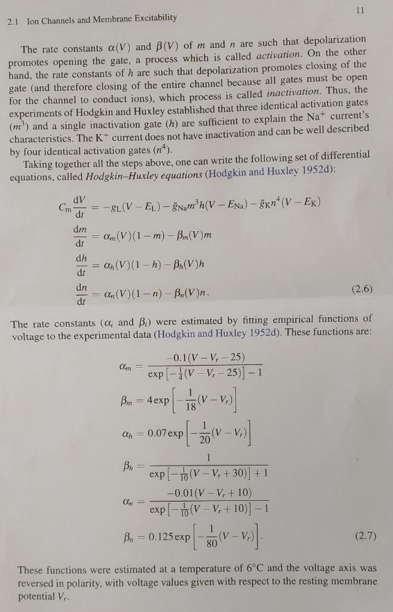

```{r setup, include=FALSE}
knitr::opts_chunk$set(echo = TRUE, warning = FALSE, message = FALSE)
```

# Hodgkin-Huxley PDMP

The Hodgkin-Huxley piecewise deterministic markov process is a model introduced by Alan Hodgkin and Andrew Huxley in 1952 with the paper "[A quantitative description of membrane current and its application to conduction and excitation in nerve](https://pubmed.ncbi.nlm.nih.gov/12991237/)."

The Hodgkin-Huxley model targets the initiation and propagation of an action potential in a neuron (Current carries through the neuron with ions penetrating the neuron's membrane or charging it).

As such, the capacitive current or capacitance flowing through  the neuron's membrane is defined as:

\begin{align}
I &= C_m\frac{dV}{dt} + I_{ion}\\
C_m\frac{dV}{dt} &=- I_{ion}\\
I_{ion} &^= g_{Na}m^3h(V-E_{Na}) + g_Kn^4(V-E_K)+g_L(V-E_L)
\end{align}

Where:

- $I$ is current per unit area
- $C_m$ is the capacitance (constant)
- $V$ is the membrane voltage/potential
- $I_{ion}$ is the current source caused by the Sodium (Na), Potassium (K) and other leaking (L) ions ($\forall i \in {Na, K, L},\,g_i$ represents the electrical conductance of voltage-gated $i$-ion channels)
- $E$ is the equilibrium potential (voltage sources) of the gates $m$, $n$, and $h$

The Hodgkin-Huxley equation above is complemented with the following four differential equations:

\begin{align}
\frac{dm}{dt}&=\alpha_m(V)(1-m)-\beta_m(V)m\\
\frac{dh}{dt}&=\alpha_h(V)(1-h)-\beta_h(V)h\\
\frac{dn}{dt}&=\alpha_n(V)(1-n)-\beta_n(V)n
\end{align}

The rate constants $\forall i \in {Na, K, L},\,\alpha_i$ and $\beta_i$ were estimated by fitting empirical functions of votage to the experimental data in the Hodgkin-Huxley paper such that:

\begin{align}
\alpha_m &= \frac{-0.1(V-V_r-25)}{exp(-\frac{1}{4}(V-V_r-25))-1} \\
\alpha_h &= 0.07.exp(-\frac{1}{20}(V-V_r))\\
\alpha_n &= \frac{-0.01(V-V_r+10)}{exp(-\frac{1}{10}(V-V_r+10))-1}\\
\beta_m &= 4.exp(-\frac{1}{18}(V-V_r))\\
\beta_h &= \frac{1}{exp(-\frac{1}{10}(V-V_r+30))+1}\\
\beta_n &= 0.125.exp(-\frac{1}{80}(V-V_r))\\
\end{align}

Where:

- $V_r$ is the membrane potential at rest

In the original model, Hodgkin and Huxley established that there were three identical activation gates $m$ and one gate $h$ to explain the Sodium (Na) current, and four identical activation gates $n$ for the Potassium (K) current.


## Simulating an example Hodgkin-Huxley PDMP

### GOAL - Example setup

We are interested in implementing the Hodgkin-Huxley model described above with one hundred gates/doors of each time ($m$, $h$, and $n$).

As such, we will first implement the original model shown above, using $m$, $h$, and $n$ as inputs to modulate the HHPDMP outputs. Then we will implement the example with 100 doors of each type.



### METHOD - Implementing useful functions

We consider 3 types of doors $m$, $h$, and $n$ such that:

- With $t$ a given timestep, $\forall i\in\{m, h, n\},\,N^i$ is the number of doors $X_t^i$ of type $i$
- Each door of type $i$ has two states $0$ and $1$ with respective transition probabilities:

\begin{align}
\forall i\in\{m, h, n\},\,\mathbb{P}_i(0\rightarrow1)&=\alpha_i(V_t)\\
\mathbb{P}_i(1\rightarrow0)&=\beta_i(V_t)\\
\end{align}

We consider $\hat{m}_t$, $\hat{h}_t$, and $\hat{n}_t$ the respective proportion of open doors of each type such that:

\begin{align}
\hat{m}_t &= \frac{1}{N^m}\underset{i=1}{\overset{N^m}{\sum}}X^{m,i}_t
\hat{h}_t &= \frac{1}{N^h}\underset{i=1}{\overset{N^h}{\sum}}X^{h,i}_t
\hat{n}_t &= \frac{1}{N^n}\underset{i=1}{\overset{N^n}{\sum}}X^{n,i}_t
\end{align}

The regimes of a Hodgkin-Huxley PDMP corresponds to the *whole* state $\big(\frac{k^m}{N^m}, \frac{k^h}{N^h}, \frac{k^n}{N^n}\big)$ or $\big(\hat{m}_t, \hat{h}_t, \hat{n}_t\big)$ where $\forall i\in\{m, h, n\},\,k^i$ corresponds to the number of open doors (i.e. $X_t^i=1$) The dynamics of $(\hat{V}_t)$ between the jumps is:

\begin{align}
C_m\frac{d}{dt}\hat{V}_t &= -g_L(\hat{V}_t - E_L) - \bar{g}_{Na} (\hat{m}_t)^3 \frac{k_2^h}{N^h} (\hat{V}_t - E_{Na}) - \bar{g}_K(\frac{k_3^n}{N^n})^4 (\hat{V}_t - E_K)\\
&= -g_L(\hat{V}_t - E_L) - \bar{g}_{Na} (\frac{k_1^m}{N^m})^3 \hat{h}_t (\hat{V}_t - E_{Na}) - \bar{g}_K(\hat{n}_t)^4 (\hat{V}_t - E_K)
\end{align}

$C_x, E_x, \bar{g}_x$ are constant.

The jumps are at rate:

\begin{align}
x&\in\{m, h, n\}\\
\text{rate}&=N^x\beta_x(\hat{V}_t)\frac{k^x}{N^x} \approx N^x\beta_x(\hat{V}_t)\hat{x}_t
\end{align}

> $\hat{x}^t$ has a jump of size $-\frac{1}{N^x}$ at rate $N^x\beta_x(\hat{V}_t)x_t$
>
> $\hat{x}^t$ has a jump of size $+\frac{1}{N^x}$ at rate $N^x\alpha_x(\hat{V}_t)(1-x_t)$

Precisely,

- $\hat{m}^t$ jumps to $\hat{m}^t-\frac{1}{N^m}$ at rate $N^m\beta_m(\hat{V}_t)\hat{m}_t$
- $\hat{m}^t$ jumps to $\hat{m}^t+\frac{1}{N^m}$ at rate $N^m\alpha_m(\hat{V}_t)(1-\hat{m}_t)$
- $\hat{h}^t$ jumps to $\hat{h}^t-\frac{1}{N^h}$ at rate $N^h\beta_h(\hat{V}_t)\hat{h}_t$
- $\hat{h}^t$ jumps to $\hat{h}^t+\frac{1}{N^h}$ at rate $N^h\alpha_h(\hat{V}_t)(1-\hat{h}_t)$
- $\hat{n}^t$ jumps to $\hat{n}^t-\frac{1}{N^n}$ at rate $N^n\beta_n(\hat{V}_t)\hat{n}_t$
- $\hat{n}^t$ jumps to $\hat{n}^t+\frac{1}{N^n}$ at rate $N^n\alpha_n(\hat{V}_t)(1-\hat{n}_t)$

<u>Simulation</u>

1. **"Rough" algorithm**

we have a small time step $\delta$, during each time step $\hat{V}_{t+\delta} = \hat{V} = \delta\frac{d}{dt}\hat{V}_t$.

\begin{align}
\hat{x}_{t+\delta} &= \hat{x}_t + \frac{1}{N^x}\text{ with probability }N^x\beta_x(\hat{V}_t)\hat{x}_t\delta\\
\hat{x}_{t+\delta} &= \hat{x}_t - \frac{1}{N^x}\text{ with probability }N^x\alpha_x(\hat{V}_t)(1-\hat{x}_t)\delta
\end{align}


### RESULTS - Simulation with the Poor/Robust algorithm

TBD

### COMMENTS

TBD

### IMPLEMENTATION WITH SIMECOL

Inspired from [R-bloggers](https://www.r-bloggers.com/2012/06/hodgkin-huxley-model-in-r/). Of note, the rate constants are not provided to be the same.

```{r library_install}

# install.packages("simecol")
library(simecol)

```

```{r HH_model}

# Declare parameters
Ena = 50
Ek  = -77
El  = -54.4

gna = 120
gk  = 36
gl  = 0.3
  
C   = 1
Vr  = -40
V   = -65
  
m   = 0.052
h   = 0.0596
n   = 0.317
  
## Hodkin-Huxley model
HH <- odeModel(
  main = function(time, init, parms) {
    with(as.list(c(init, parms)),{

      am <- function(V) -0.1*(V-Vr-25)/(exp(-1/4*(V-Vr-25))-1)
      ah <- function(V) 0.07*exp(-1/20*(V-Vr))
      an <- function(V) -0.01*(V-Vr+10)/(exp(-1/10*(V-Vr+10))-1)
      bm <- function(V) 4*exp(-1/18*(V-Vr))
      bh <- function(V) 1/(exp(-1/10*(V-Vr+30))+1)
      bn <- function(V) 0.125*exp(-1/80*(V-Vr))
      
      dvdt = (-gna*m^3*h*(V-Ena) - gk*n^4*(V-Ek) - gl*(V-El))/C
      dmdt =  am(V)*(1-m) - bm(V)*m
      dhdt = ah(V)*(1-h) - bh(V)*h
      dndt = an(V)*(1-n) - bn(V)*n
      
      return(list(c(dvdt, dmdt, dhdt, dndt)))
    })
  },
  # Sets the parameters
  parms = c(Ena=Ena, Ek=Ek, El=El, gna=gna, gk=gk, gl=gl, C=C, Vr=Vr),
  # Sets the integration parameters
  times = c(from=0, to=40, by=0.25),
  # Sets the initial state
  init = c(V=V, m=m, h=h, n=n),
  solver = "lsoda"
)

```

```{r run_model}

HH <- sim(HH)
plot(HH)

```
