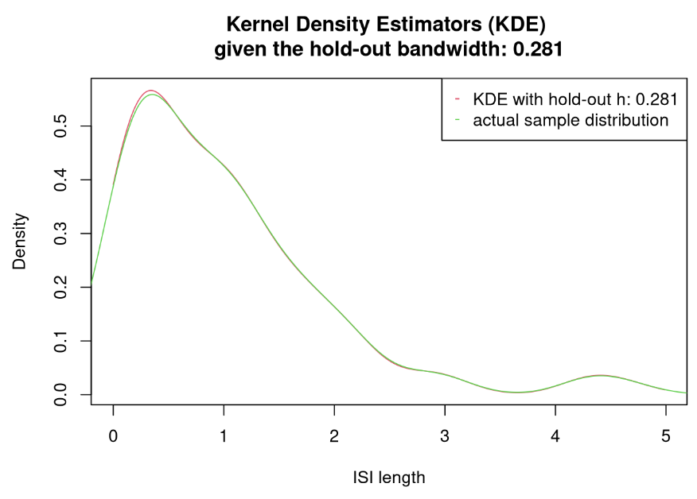
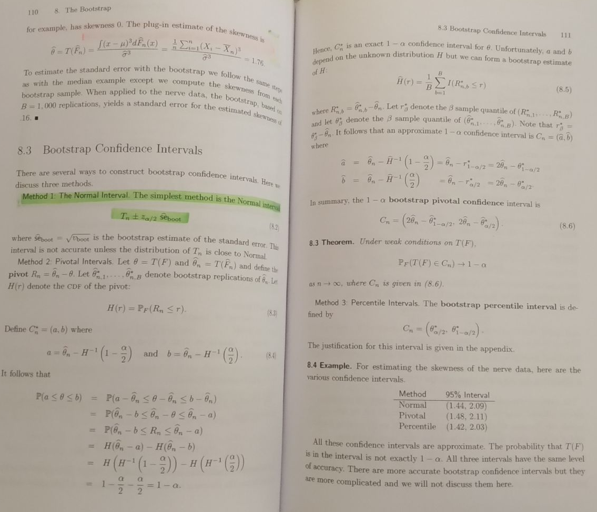

```{r setup, include=FALSE}
knitr::opts_chunk$set(echo = TRUE)
```

# 1 - Cross-Validation For Kernel Estimators

## Overview 

For the independent and identically distributed interspike intervals $X_1, ..., X_n$, let us look more carefully to the kernel estimators of the underlying density $f$. We choose $K(x)=\frac{\exp(-x^2/2)}{\sqrt{2\pi}}$. The kernel estimator with bandwidth $h$ is defined as:
$$\hat{f}_h(u)=\frac{1}{nh}\sum^n_{i=1}K\big(\frac{u-X_i}{h}\big)$$

**A** -- We implement a R function that computes, for a given vector $u$ and a given window $h$, the value $\hat{f}_h(.)$ for each coordinate of the vector $u$. We then simulate some exponential variables and try different values for $h$.

**B** -- Choosing $h$ can be done with cross-validation. To do so, we rely on the least-square contrast: $$C(g) = -\frac{2}{n}\sum^n_{i=1}g(X_i) + \int g(x)^2dx$$ Such that $\mathbb{E}[C(g)]$ is minimal when $f=g$ where $g$ is a candidate density. We demonstrate that.

**C** -- Using the R function `integrate`, we compute the integral of the kernel estimator $f$ to the square and implement a function to compute the least square contrast on a different sample than the one previously used.

**D** -- We implement the hold-out estimator (the data is cut in half at random, half being used for estimation, and the other half for the selection of the bandwidth parameter $h$). We plot the corresponding estimator aftewards.

## Step a

We declare the functions $K(.)$ and $\hat{f}_h(.)$ under the name `kernel` and `kernel_estimator` espectively:

```{r kernel_functions_declarations}

kernel <- function(x) {
  # Declaration of the Gaussian kernel function K(x)
  exp(-1*x^2/2)/sqrt(2*pi)
}

kernel_estimator <- function(ISI, u, h) {
  # Declaration of the kernel estimator
  # note: looks like a DFT with a sliding window
  #
  # Formats the ISI as a matrix and retrieves its length
  ISI = as.matrix(ISI); n = length(ISI)
  # Precomputes the rescale factor of the kernel estimator
  rescale_factor = 1/(n*h)
  # Computes the estimator for each u-coordinate
  f_hat = c()
  for (index in 1:length(u)) {
    kerneling = sum(apply(ISI, 1, function(x){kernel((u[index]-x)/h)}))
    f_hat = cbind(f_hat, c(rescale_factor * kerneling))
  }
  # Returns the estimator
  f_hat
}

```

We now simulate a set of interspike intervals ($n=100$) via the exponential distribution using the default rate parameter $rate=1$. Then we run our kernel estimator with a preselected vector $u=(0.0, 0.1,...,10.0)^T$ over the set of $h$-parameters $\{0.1, ..., 0.5\}$.

```{r isi_simulation_and_kerneling}

# Declares parameters
n = 100
u_stepsize = 0.01
u = seq(0, 9.99, u_stepsize)
h = as.matrix(seq(0.05, 0.5, 0.05))

# Simulates interspike intervals
ISI = rexp(n, rate=1)

# Computes the kernel estimator for each h
estimators = apply(h, 1, function(x) {kernel_estimator(ISI, u, x)})

# Declares the end data.frame holding the estimators
names_col = apply(h, 1, function(x){paste("h_",x,sep="")})
estimators = as.data.frame(estimators, row.names=u)
estimators = setNames(estimators, names_col) # naming cols within as.d.f fails for me

```

We can then display the resulting estimators over our preselected range of $h$ bandwidths, given the vector $u$ and our randomly generated interspike intervals.

```{r print_kernel_estimators}

head(estimators)

```

We can also visualize the resulting kernel densities truncated to the first half length of the range/vector $u$:

```{r visualize_kernel_estimators, out.width="100%"}

plot_kde <- function(kernel_estimates, range_to_plot=c(1:500)){
  # Plots the KDE collected in a given data.frame
  plot(u[range_to_plot], kernel_estimates[range_to_plot,1], 
       type="l", col=2, ylab="Density", xlab="ISI length",
       main="Kernel Density Estimators (KDE) given five bandwidths h")
  for (cl in 2:dim(kernel_estimates)[2]) {
    lines(u[range_to_plot], kernel_estimates[range_to_plot,cl], 
          type="l", col=cl+1)
  }
  legend("topright", legend=colnames(kernel_estimates), 
         col=c(2:(dim(kernel_estimates)[2]+1)), pch="-")
}

plot_kde(estimators)

```

## Step b

We set the least-square contrast for density $C$ such that:
\begin{align}
\forall i \in \{1, ..., n\}&,\,X_i\sim f,\,\text{ IID}\\
g&,\,\text{ a candidate density}\\
C(g) &= -\frac{2}{n}\sum^n_{i=1}g(X_i) + \int g(x)^2dx
\end{align}

As such, we can set the expectation of $C$ as such, with $g$ a candidate density:

\begin{align}
\mathbb{E}_{\forall i \in \{1, ..., n\},\,X_i\sim f}\big[C(g)\big]&=\mathbb{E}\big[-\frac{2}{n}\sum^n_{i=1}g(X_i) + \int g(x)^2dx\big]\\
&=-\frac{2}{n}\sum^n_{i=1}\int g(x)f(x) dx + \int g(x)^2dx\\
&=-2\int g(x)f(x) dx + \int g(x)^2dx\\
&=\int (g(x)-f(x))^2 dx - \int f(x)^2dx
\end{align}

Given that $\int f(x)^2dx$ is a constant, $\mathbb{E}_{\forall i \in \{1, ..., n\},\,X_i\sim f}\big[C(g)\big]$ is minimal when $\int (g(x)f(x))^2 dx$ is minimal. As such, we find:

\begin{align}
\int (g(x)-f(x))^2 dx&\ge0\\
\int (g(x)-f(x))^2 dx&=0\text{ if and only if }\forall x,\,g(x)-f(x)=0\\
\end{align}

We can conclude that $\mathbb{E}[C(g)]$ is minimal when the candidate density $g$ is equal to the density $f$ given $\forall i \in \{1, ..., n\},\,X_i\sim f,\,\text{ IID}$.

## Step c

We want to build and compute using the following function: $$C(f) = -\frac{2}{n}\sum^n_{i=1}f(X_i) + \int f(x)^2dx$$We can build the integral part by reusing the previously declared function `kernel_estimator`. We pre-emptively create a contrast function that can handle a train and a validation/test set for the steps d and e. 

```{r constrast_function_declaration}

integrate_kde <- function(kde) {
  # Integrates a kde function over its support (here R_+)
  integrate(Vectorize(kde), 
            lower=0, upper = Inf, 
            subdivisions=5000)
}

contrast_least_squares <- function(ISI_train, u, u_stepsize, h, ISI_test=NULL){
  # Declares the least-square contrast function
  # 
  # Formats the ISI as a matrix and retrieves its length
  ISI_train = as.matrix(ISI_train)
  if (!is.null(ISI_test)) {
    ISI_test = as.matrix(ISI_test); n = length(ISI_test)
  } else {
    ISI_test = as.matrix(ISI_train); n = length(ISI_train)
  }
  # Computes the kernel estimators and the corresponding KDE
  estimators = kernel_estimator(ISI_train, u, h)
  # Declares useful functions to compute the densities
  na_check <- function(x) {if (is.na(x) || is.null(x)) {-Inf} else {x}}
  support_check <- function(x) {if (x < min(u) || x > max(u)) {T} else {F}}
  kde <- function(x) {
    if (support_check(na_check(x))) {
      0
    } else {
      x = as.vector(estimators)[round(x/u_stepsize)]
      if (length(x)==0 || is.na(x)) {0} else {x}
    }
  }
  kde_squared <- function(x) {kde(x)^2}
  # Computes the relative likelihood of each X given the computed
  # Kernel Density Estimation
  densities = apply(ISI_test, 1, kde)
  # Computes the corresponding integral of the kernel estimator
  integration = integrate_kde(kde_squared)
  #cat(paste("Integration result: ", integration,"\n"))
  # Computes and return the contrast
  contrast = -1*2/n*sum(unlist(densities), na.rm=T) + integration$value
  contrast
}

```

Now that we have our functions, we can generate a new sample, drawn from the same exponential distribution as previously stated. We also update the support for our bandwidth parameters $h$ so that we have a finer grid. We also increase our sample size from 100 to 1000.

```{r isi_simulation_2}

# Updates parameters
h = as.matrix(seq(0.01, 0.5, 0.01))
n = 100

# Simulates interspike intervals
ISI = rexp(n, rate=1)

```

Reusing our previous parameters, we compute the contrast for the newly simulated ISI:

```{r compute_contrast, out.width="100%"}

# Declares parameter
u_stepsize = 0.01
u = seq(0., 5., u_stepsize)
h = as.matrix(seq(0.001, 0.51, 0.02))

# Computes the resulting contrasts
contrasts = apply(h,1,function(x) {
  contrast_least_squares(ISI, u, u_stepsize, x)
})

# Plots the given contrasts for the set of bandwidths h

plot(h, contrasts, type="l",
     xlab="Bandwidth Parameter h", ylab="Contrast",
     main="Least-Square Contrast on a Exponential distribution Exp(1)")

```

The lowest contrast was achieved on the new simulation of the exponential distribution $\mathcal{E}(1)$ with the bandwidth parameter $h$ set to:

```{r best_h}

best_h = h[which(contrasts==min(contrasts))]
best_h

```

With this bandwidth value, we want to compare the kernel estimator's resulting distribution against the actual sample distribution.

```{r kde, out.width="100%"}

# Declares the plotting function
plot_kde_vs_sample_dist <- function(estimator, ISI, best_h, val_method=""){
    # Plots the KDE collected in a given data.frame
  range_to_plot = 1:500
  plot(u[range_to_plot], estimator[range_to_plot], 
         type="l", col=2, ylab="Density", xlab="ISI length",
         main=paste("Kernel Density Estimators (KDE)",
                    "\ngiven the", val_method, "bandwidth:",best_h))
  lines(density(ISI), type="l", col=3)
  legend("topright", legend=c(paste("KDE with", val_method, "h:",best_h),
                              "actual sample distribution"), col=c(2, 3), 
         pch="-")
}

# Computes the kernel estimates again with the selected h
estimator = kernel_estimator(ISI, u, best_h)

# Plots the distribution
plot_kde_vs_sample_dist(estimator, ISI, best_h)

```

We clearly see that the resulting bandwidth parameter $h$ does not help fit the actual distribution. We need to find a better way to determine which $h$ is the best. This will be looked at in the next step with cross-validation.

## Step d

In order to perform hold-out validation, we first start by implementing the data processing pipeline for the hold-out estimator.

```{r holdout_validation_process}

dataset_split_holdout <- function(dataset) {
  # We implement a hold-out dataset splitting function. It 
  # randomly split the input data into two equal-length subsets.
  n = length(dataset)
  split_point = round(n/2)
  scrambled_data = sample(dataset)
  return(list(
    "train"=scrambled_data[1:split_point],
    "test"=scrambled_data[(1+split_point):n])
  )
}

sets = dataset_split_holdout(ISI)

```

Once we have our two sets, we can run the same process as before:

```{r compute_contrast_hold_out, out.width="100%"}

# Computes the resulting contrasts
contrasts = apply(h,1,function(x) {
  contrast_least_squares(sets$train, u, u_stepsize, x, sets$test)
})

# Plots the given contrasts for the set of bandwidths h
plot(h, contrasts, type="l",
     xlab="Bandwidth Parameter h", ylab="Contrast",
     main="Least-Square Contrast on a Exp. distribution Exp(1)\nwith Hold-Out Validation")

```

After hold-out validation, the lowest contrast was achieved on the simulation of the exponential distribution $\mathcal{E}(1)$ with the bandwidth parameter $h$ set to:

```{r best_h_hold_out}

best_h = h[which(contrasts==min(contrasts))]
best_h

```

Now that we have a best parameter $h$ given the hold-out validation, we can compute and plot the kernel estimator again based on it.

```{r hold_out_kde, out.width="100%"}

# Computes the kernel estimates again with the selected h
estimator = kernel_estimator(ISI, u, best_h)

# Plots the distribution
plot_kde_vs_sample_dist(estimator, ISI, best_h, val_method="hold-out")

```

## Step e

In order to implement our cross-validation, we implement a specifically design loop function to iterate over both the available data and the set of possible bandwidth parameters $h$.

```{r v_fold_validation_process}

v_fold_cross_validation <- function(ISI, h, v, u, u_stepsize) {
  # We implement a v-fold cross-validation process over a ISI dataset
  # in order to find the best bandwidth parameter h out of a candidate list
  #
  # We create v-folds out of the input ISI dataset
  n = length(ISI)
  folds = split(ISI,ceiling(seq_along(ISI)/round(length(ISI)/v)))
  contrasts = c()
  for (test_fold in 1:v) {
    # Computes the data to be used for training and for testing
    train_folds = c(1:v)[c(1:v)!=test_fold]
    train_ISI = as.vector(unlist(folds[train_folds]))
    test_ISI = as.vector(unlist(folds[test_fold]))
    # Computes the contrasts for each fold pass
    contrast = apply(h,1,function(x) {
      contrast_least_squares(train_ISI, u, u_stepsize, x, test_ISI)
    })
    # Records the computed contrats
    contrasts = cbind(contrasts, contrast)
  }
  1/v*apply(contrasts,1,sum)
}

```

We decide to set our number of folds to $10$ in order to compute and visualize our V-fold Cross-Validation.

```{r v_fold_computation, out.width="100%"}

# Declares v
v = 10

# Computes the v_fold_contrasts
v_fold_contrasts = v_fold_cross_validation(ISI, h, 10, u, u_stepsize)

# Plots the given contrasts for the set of bandwidths h
plot(h, v_fold_contrasts, type="l",
     xlab="Bandwidth Parameter h", ylab="Contrast",
     main="Least-Square Contrast on a Exp. distribution Exp(1)\nwith V-Fold Cross-Validation")

```

After v-fold cross-validation, the lowest contrast was achieved on the simulation of the exponential distribution $\mathcal{E}(1)$ with the bandwidth parameter $h$ set to:

```{r best_h_v_fold}

best_h = h[which(v_fold_contrasts==min(v_fold_contrasts))]
best_h

```

Now that we have a best parameter $h$ given the hold-out validation, we can compute and plot the kernel estimator again based on it.

```{r v_fold_kde, out.width="100%"}

# Computes the kernel estimates again with the selected h
estimator = kernel_estimator(ISI, u, best_h)

# Plots the distribution
plot_kde_vs_sample_dist(estimator, ISI, best_h, val_method="v-fold cross-validation")

```

### Note on step d and e

We observe, by visual inspection of the plots, that the estimations with the hold-out and v-fold cross-validation perform better than the first method (which did not use any kind of validation). 

In general, we find that the hold-out method tends to generally provide an equivalent or better estimation than v-fold cross-validation given the case used above (i.e. with this specific selection of $h$ bandwidth and $u$ range. Once it happened that the hold-out method found this approximation, which is very close to the actual sample density:



# 2 - Parametric Bootstrap

## Overview 

We present the implementation of a parametric bootstrap.

**A** -- Let's simulate $n = 50$ exponential variables with parameter $\theta_0 = 2$. This will be considered as observations.

**B** -- Let's compute the Maximum Likelihood Estimator (MLE) $\hat{\theta}_{obs}$ of $\theta$ for $n=50$ IID ISI modeled by an exponential distribution.

**C** -- By simulating $N_simu = 10000$ times $n$ exponential variables with parameter $\theta_0 = 2$, let's compute an approximate classical confidence interval $IC_1$ on 4\theta$ with confidence $95%$.

<u>Of note:</u> To do that, one can for instance compute $D_i = |\hat{\theta}_i − \theta_0 |$ on each simulation and decide that, with a c. $95%$ probability, the distance between $\hat{\theta}$ and $\theta_0$ is less than the $95%$ empirical quantile of $D_i$. this cannot be done on real data since $\theta_0$ is not known.

**D** -- By bootstrapping the data the parametric approach, let's compute a bootstrap confidence interval IC2. To do so, we simulate $N$ times $n$ exponential variables with parameter $\theta = \hat{\theta}$ and do as before with respect to the simulation.

**E** -- Let's compare $IC_1$ and $IC_2$ for various size of $N$. Let's also explain why $IC_2$ cannot converge to $IC_1$ when $N\rightarrow+\infty$, even if it is a pretty good approximation.

## Step a

```{r parametric_bootstrap_simulation}

# Declares parameters
n = 50
theta_0 = 2

# Simulates
observations = rexp(n, theta_0)

```

## Step b

The parametric approach informs us that the MLE for IID ISI modeled by an exponential distribution is the following: $\hat{\theta}_{obs}=\frac{1}{\bar{X}}$ with $\bar{X}$ the sample mean of the observations. The proof can be found here: [StatLect](https://www.statlect.com/fundamentals-of-statistics/exponential-distribution-maximum-likelihood) (last accessed, Dec 5, 2021).

```{r parametric_bootstrap_MLE}

hat_theta_obs <- function(observations){
  # Computes the MLE of observations following an exponential distribution
  1/(mean(observations))
}

# Computes and prints the MLE of the generated 50 observations
hat_theta = hat_theta_obs(observations)
hat_theta

```

## Step c

We want to compute the $95%$ confidence interval $IC_1$ of $\theta$. To do that, we can derive $IC_1$ by preliminarily computing the $95%$ quantile of $D$: $$\forall i\in\{1, ..., n_{simulations}\},\,\,D_i = |\hat{\theta}_i − \theta_0 |$$.

```{r parametric_bootstrap_D}

compute_distances <- function(N, n, theta_0) {
  # Computes the MLE of each simuation
  hat_theta_sims = apply(matrix(1:n_simulations), 1, 
                         function(x) {hat_theta_obs(rexp(n, theta_0))})
  # Computes the difference/distance between each MLE and the 
  # real parameter theta_0
  abs(theta_0-hat_theta_sims)
}

# Declares variables
n_simulations = 10000

distances = compute_distances(n_simulations, n, theta_0)

```

Since we have obtained $D_i, \forall i\in\{1, ..., n_{simulations}\}$, we can plot the distribution of $D$ for visualization purposes.

```{r parametric_bootstrap_Ddistribution, out.width="100%"}

plot(density(distances), xlab="", ylab="",
     main="Distribution of the distances of theta_hat to theta_0")

```

We compute the $95%$ quantile of $D$ and can rework the $95%$ confidence interval on $\theta$. 

```{r parametric_bootstrap_IC1}

compute_95CI <- function(distances, theta_0, print_msg=F) {
  # Computes the 95% quantile of D
  quantile95_distances = quantile(distances, probs=c(0.95))
  
  # Computes and prints the resulting CI1 of theta
  CI1 = c(theta_0-quantile95_distances, theta_0+quantile95_distances)
  CI1 = t(as.matrix(setNames(CI1, c("2.5%", "97.5%"))))
  if (print_msg) {
    cat("The classical 95% confidence interval for theta is:\n", CI1)
  }
  CI1
}

IC1 = compute_95CI(distances, theta_0, T)

```

## Step d

We reuse the content used in steps A and B for the following steps. To perform the parametric bootstrapping, we arbitrarily set $N=10000$ as with step C.  

```{r parametric_bootstrap_IC2}

# Declares or recalls the parameters
N = 10000
n= 50

# Declares the bootstrap version of compute_distances
compute_distances_bootstrap <- function(N, n, observations) {
  # Computes the MLE of each simuation
  hat_theta_sims = apply(matrix(1:n_simulations), 1, 
                         function(x) {hat_theta_obs(
                           sample(observations, n, replace=T)
                         )})
  # Computes the difference/distance between each MLE and the 
  # real parameter theta_0
  abs(theta_0-hat_theta_sims)
}

# We substitute our previously computed hat_theta for theta_0 in the 
# previously declared function setup

distances = compute_distances_bootstrap(n_simulations, n, observations)
IC2 = compute_95CI(distances, hat_theta, T)

```

## Step e

We reuse the previous process, varying $N$ from $10$ to $1e12$ by order of grandeurs.

```{r parametric_bootstrap_IC1vIC2}

# Declares the range for N_simulations
N_range = matrix(apply(matrix(1:12), 1, function(x){10^x}))

# Declares the composition function to compute CIs
compute_ci <- function(n_simulations, n, theta, observations, bootstrap=F) {
  if (bootstrap) {
    compute_95CI(compute_distances_bootstrap(n_simulations, n, observations), theta)
  } else {
    compute_95CI(compute_distances(n_simulations, n, theta), theta)
  }
}

# Computes the CI1 and CI2 for the given N range
cis = apply(N_range, 1, function(x){c(compute_ci(x, n, theta_0),
                                      compute_ci(x, n, hat_theta, observations, T))})
cis = t(cis)
row.names(cis) = N_range
colnames(cis) = c("CI1_0.025","CI1_0.975","CI2_0.025","CI2_0.975")
cis

```
We compute the difference between $CI_1$ and $CI_2$'s confidence interval lower and upper bounds. We then plot those differences.

```{r r parametric_bootstrap_IC1vIC2_2, out.width="100%"}

differences = c(cis[,3]-cis[,1], cis[,4]-cis[,2])
differences = matrix(differences, ncol=2)

plot(differences[,1], 
     ylim = c(min(differences), max(differences)+0.2), 
     type="l", col=2, xaxt="n", ylab="difference between CI1 and CI2",
     xlab="Number of simulations for bootstrapping")
axis(1, at=c(1:12), labels=as.vector(N_range))
lines(differences[,2], type="l", col=3)
legend("topright", legend=c("CI 0.025% threshold", "CI 0.975% threshold"),
       col=c(2,3), pch="-")

```

We evidence that we do not see an apparent convergence of the two confidence intervals. 

This is due to the theory of the bootstrap pivotal confidence interval (see picture from *All of Statistics*, by L. Wasserman, p111) that states that the boostrap confidence interval will converge towards that given interval $C_n$, but that confidence interval is not the original (but is close) as we are working with bootstrapped value where the underlying distribution is not $\exp(\theta_0)$ but the bootstrapped one, which is never exactly the same.



## Step f

# 3 - Non-Parametric Boostrap

## Overview 

## Step a

## Step b

## Step c

# 4 - Clustering

## Overview 

## Step a

## Step b

## Step c

## Step d