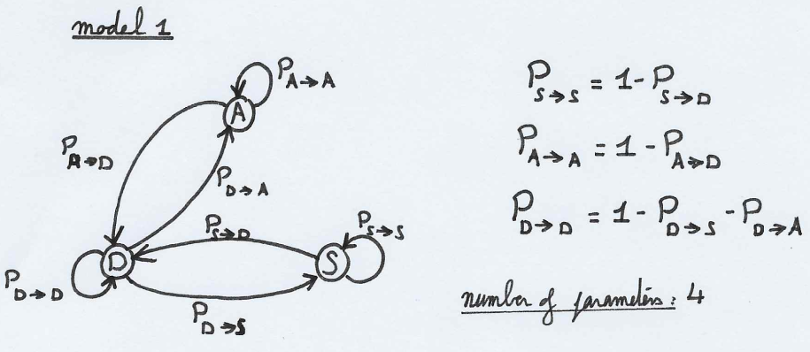
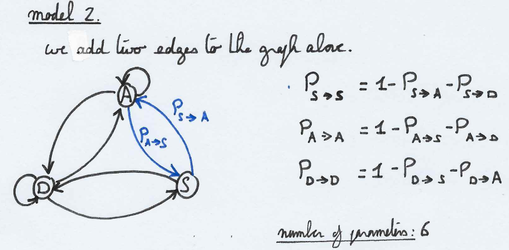

```{r setup, include=FALSE}
knitr::opts_chunk$set(echo = TRUE)
```

<hr>

## Question 1 - Maximum likelihood for Markov chain 

Given a cognitive context of sleeping patterns, a check is performed every five minutes on study participants and their state is noted. We want to model this by a (discrete) Markov chain with 3 states:
- "sleeping"
- "(fully) awake"
- "drowsy"

**Step A** -- Plot the diagrams and parametrize the two following (informal) models with the least
possible amount of parameters
- You can only pass from "fully awake" to "sleeping" through the state "drowsy" and
vice-versa: you can only go from sleeping to "fully awake" through "drowsy".
- It is possible (but not necessary) to be instantly awake or instantly sleeping and to
skip the "drowsy" state.

**Step B** -- Make a function in R which simulates the first model if you give in entries the state $x_0$,
the parameters of the model (only the ones parametrizing the transitions) and the length of the chain to simulate $n$.

**Step C** -- Write the (log)-likelihood of this problem and give the maximum likelihood estimator of $P_{D\rightarrow S}$, the probabilty to fall asleep when you are drowsy. Would it be different if we were in the second model?

**Step D** -- Show on simulation that this estimator converges towards the true probability when n tends to infinity.

**Step E** -- How would you decide if we are in the first or second model when you have the observations?

### STEP A

The first model is defined as in picture 1 attached, with a **minimum of four parameters** such that:

\begin{align}
\text{parameter space}&\text{:}\quad\{P_{A\rightarrow D},P_{S\rightarrow D},P_{D\rightarrow A},P_{D\rightarrow S})\}\\
P_{A\rightarrow A}&=1-P_{A\rightarrow D}\\
P_{S\rightarrow S}&=1-P_{S\rightarrow D}\\
P_{D\rightarrow D}&=1-P_{D\rightarrow A}-P_{D\rightarrow S}\\
\end{align}

With $A$ the "awake" state, $S$ the "sleeping" state, and $D$ the "drowsy" state.

**Of note**, if the selection of the state at time $T=0$ (i.e. the start state) is also random, we have to add 2 more parameters: $P(x_0=A)$ and $P(x_0=S)$ such that $P(x_0=D)=1-P(x_0=A)-P(x_0=S)$. As such, it would bring model 1's **number of parameters to six**.



The second model is defined as in picture 2 attached, with a **minimum of six parameters** such that:

\begin{align}
\text{parameter space}&\text{:}\quad\{P_{A\rightarrow D},P_{A\rightarrow S},P_{S\rightarrow D},P_{S\rightarrow A},P_{D\rightarrow A},P_{D\rightarrow S})\}\\
P_{A\rightarrow A}&=1-P_{A\rightarrow D}\\
P_{S\rightarrow S}&=1-P_{S\rightarrow D}\\
P_{D\rightarrow D}&=1-P_{D\rightarrow A}-P_{D\rightarrow S}\\
\end{align}

**Of note**, if the selection of the state at time $T=0$ (i.e. the start state) is also random, we have to add 2 more parameters: $P(x_0=A)$ and $P(x_0=S)$ such that $P(x_0=D)=1-P(x_0=A)-P(x_0=S)$. As such, it would bring model 2's **number of parameters to eight**.



### STEP B

```{r generate_model_1}

compute_jump <- function(state, p_AtoD, p_StoD, p_DtoS, p_DtoA){
  ### Computes the next jump
  if (state == "A"){
    draw = rbinom(1, 1, p_AtoD)
    if (draw == 1){
      return("D")
    } else {
      return("A")
    }
  }
  if (state == "S") {
    draw = rbinom(1, 1, p_StoD)
    if (draw == 1){
      return("D")
    } else {
      return("S")
    }
  }
  # Else (State is drowsy)
  draw = runif(1, 0, 1)
  if (draw < p_DtoS){
      return("S")
    } else if (draw < p_DtoS + p_DtoA) {
      return("A")
    } else {
      return("D")
    }
}

generate_process_from_model1 <- function(x0, n, p_AtoD, p_StoD, p_DtoS, p_DtoA){
  ### Generates a process given the model 1 previously discribed
  ### x0: start state, p_AtoD: jump probability from A to D, 
  ### p_StoD: jump probability from S to D, n: process length
  if (!x0 %in% c("A","S","D")) {
    print("Wrong input for entry state x0")
    return(0)
  }
  process = c(x0)
  for (step in c(1:n)) {
    x0 = compute_jump(x0, p_AtoD, p_StoD, p_DtoS, p_DtoA)
    process = c(process, x0)
  }
  return(process)
}

```

We produce a couple examples:

```{r generated_model1_example1}

p_AtoD = 0.4
p_StoD = 0.2
p_DtoS = 0.4 
p_DtoA = 0.4
generate_process_from_model1("A", 50, p_AtoD, p_StoD, p_DtoS, p_DtoA)
generate_process_from_model1("S", 50, p_AtoD, p_StoD, p_DtoS, p_DtoA)
generate_process_from_model1("D", 50, p_AtoD, p_StoD, p_DtoS, p_DtoA)

```

### STEP C

Given the parameter space $\theta=\{P_{A\rightarrow D},P_{S\rightarrow D},P_{D\rightarrow A},P_{D\rightarrow S})\}$, for a given $n$-length realization of the model 1's process $x_0, ..., x_n$ is given by:

\begin{align}
P_\theta((X_0, ..., X_n)&=(x_0, ..., x_n))\\
&=P_\theta(X_0=x_0, ..., X_n=x_n)\\
&=P_\theta(X_0=x_0).P_\theta(X_1=x_1|X_0=x_0).\,...\,.P_\theta(X_n=x_n, ..., X_{n-1}=x_{n-1})\\
\end{align}

Given this setup, and including the parameters $P(x_0=A)$ and $P(x_0=S)$ such that $P(x_0=D)=1-P(x_0=A)-P(x_0=S)$ as noted in Step B, we can rewrite $P_\theta(X_0=x_0, ..., X_n=x_n)$ such that:

\begin{align}
P_\theta(X_0=x_0, ..., X_n=x_n)&=P(x_0=A)^{\mathbb{1}_{x_0=A}}.P(x_0=S)^{\mathbb{1}_{x_0=S}}.(1-P(x_0=A)-P(x_0=S))^{\mathbb{1}_{x_0=D}}\\&.P_{A\rightarrow A}^{n_{A\rightarrow A}}.P_{S\rightarrow S}^{n_{S\rightarrow AS}}.P_{D\rightarrow D}^{n_{D\rightarrow D}}.P_{A\rightarrow D}^{n_{A\rightarrow D}}.P_{S\rightarrow D}^{n_{S\rightarrow D}}.P_{D\rightarrow A}^{n_{D\rightarrow A}}.P_{D\rightarrow S}^{n_{D\rightarrow S}}\\
\end{align}

so, the likelihood of a Model 1 sequence $X_0, ..., X_n$ with counts $n_{i\rightarrow j}$ (the number of times a transition from state $i$ to state $j$ has occured in the sequence) is given by:

\begin{align}
L_\theta(X)&=P(x_0=A)^{\mathbb{1}_{x_0=A}}.P(x_0=S)^{\mathbb{1}_{x_0=S}}.(1-P(x_0=A)-P(x_0=S))^{\mathbb{1}_{x_0=D}}\\&.(1-P_{A\rightarrow D})^{n_{A\rightarrow A}}.(1-P_{S\rightarrow D})^{n_{S\rightarrow AS}}.(1-P_{D\rightarrow A}-P_{D\rightarrow S})^{n_{D\rightarrow D}}\\&.P_{A\rightarrow D}^{n_{A\rightarrow D}}.P_{S\rightarrow D}^{n_{S\rightarrow D}}.P_{D\rightarrow A}^{n_{D\rightarrow A}}.P_{D\rightarrow S}^{n_{D\rightarrow S}}\\
\end{align}

the respective log-likelihood becomes:

\begin{align}
l_\theta(X)&=\mathbb{1}_{x_0=A}.log(P(x_0=A)) + \mathbb{1}_{x_0=S}.log(P(x_0=S)) + \mathbb{1}_{x_0=D}.log(1-P(x_0=A)-P(x_0=S))\\&+n_{A\rightarrow A}.log(1-P_{A\rightarrow D})+n_{S\rightarrow AS}.log(1-P_{S\rightarrow D})+n_{D\rightarrow D}.log(1-P_{D\rightarrow A}-P_{D\rightarrow S})\\&+n_{A\rightarrow D}.log(P_{A\rightarrow D})+n_{S\rightarrow D}.log(P_{S\rightarrow D})+n_{D\rightarrow A}.log(P_{D\rightarrow A})+n_{D\rightarrow S}.log(P_{D\rightarrow S})\\
\end{align}

Inspired from [here](https://www.stat.cmu.edu/~cshalizi/dst/20/lectures/19/lecture-19.html#(5)), we can rearrange the log-likelihood for simplicity:

\begin{align}
l_\theta(X)&=log(P(X_0=x_0))+\overset{n-1}{\underset{t=0}{\sum}}log(P_{x_{t}\rightarrow x_{t+1}})\\
&\equiv \overset{n-1}{\underset{t=0}{\sum}}log(P_{x_{t}\rightarrow x_{t+1}})\quad\text{(Conditioned on the initial state $x_0$)}\\
&\equiv -\frac{1}{n}\overset{n-1}{\underset{t=0}{\sum}}log(P_{x_{t}\rightarrow x_{t+1}})\quad\text{(Normalized, and signed for minimization purposes)}\\
\end{align}

We defined $N_{i\rightarrow j}$ the number of times the state $j$ follows the state $i$ in a given process. As such:

\begin{align}
N_i &= \sum_j N_{i\rightarrow j}\\
n &= \sum_i N_i\\
l_\theta(X)&\equiv-\frac{1}{n}\overset{n-1}{\underset{t=0}{\sum}}log(P_{x_{t}\rightarrow x_{t+1}})=-\frac{1}{n}\underset{i, j}{\sum}N_{i\rightarrow j}log(P_{i\rightarrow j})\quad\text{(sum over time vs. sum over state pairs)}
\end{align}

We are now interested in the maximum likelihood estimator (MLE) of the transition $i'\rightarrow j'$.

\begin{align}
\frac{\delta}{\delta P_{i'\rightarrow j'}}l_\theta(X)\equiv&-\frac{N_{i'\rightarrow j'}}{n}.\frac{1}{P_{i'\rightarrow j'}}
\end{align}

With $n$, the number of times the sequence was in state $i'$.

We want to minimize the above formula. As such we find that the simplest answer is:

$$\hat{P}_{i'\rightarrow j'}=\frac{N_{i'\rightarrow j'}}{n}$$

With $n$, the number of times the sequence was in state $i'$.

<u>Maximum likelihood estimator of $P_{D\rightarrow S}$ for model 1:</u>

Given the agnostic formula above, we find that:

$$\hat{P}_{D\rightarrow S}=\frac{N_{D\rightarrow S}}{n}$$
With $n$, the number of times the sequence was in state $i'$.

<u>Maximum likelihood estimator of $P_{D\rightarrow S}$ for model 2:</u>

Given that the above formula is agnostic to the different possible transitions except the one being estimated (i.e. $i'\rightarrow j'$, and in our more specific cases of model 1 and 2: $D\rightarrow S$), the formula would remain unchanged. As such:

$$\hat{P}^{model\,1}_{D\rightarrow S}=\hat{P}^{model\,2}_{D\rightarrow S}=\frac{N_{D\rightarrow S}}{n}$$
With $n$, the number of times the sequence was in state $D$.

### STEP D

We declare our function computing the estimator as stated above.

```{r MLE_estimator}

compute_estimator <- function(sequence, start_state, end_state){
  ### Computes the MLE estimator of the transition probability between
  ### <start_state> and <end_state>. 
  # Computes all transitions in the sequence
  transitions = c()
  for (i in 1:(length(sequence)-1)){
    transitions = cbind(transitions, paste(sequence[i], "-", sequence[i+1]))
  }
  counter = table(transitions)
  # Computes the number of occurences of target transition
  transition_to_check = paste(start_state, "-", end_state)
  n_transition = counter[names(counter)==transition_to_check][[1]]
  # Returns the estimator
  n = sum(counter[substr(names(counter),1,1)==start_state])
  return(round(n_transition/n, 3))
}

```

We now try to compute the estimator convergence for a given transition on model 1, reusing the parameters previously declared in Step B, with an increasing length for the sequence.

We check for the transitions:

\begin{align}
P_{A\rightarrow D} &= 0.4\\
P_{S\rightarrow D} &= 0.2\\
P_{D\rightarrow S} &= 0.4\\
P_{D\rightarrow A} &= 0.4\\
P_{D\rightarrow D} &= 1-P_{D\rightarrow S}-P_{D\rightarrow A}=0.2\\
P_{A\rightarrow A} &= 1 - P_{A\rightarrow D} = 0.6\\
P_{S\rightarrow S} &= 1 - P_{S\rightarrow D} = 0.8\\
\end{align}

```{r MLE_estimator_convergence}

for (n in c(50, 100, 500, 1000, 5000, 10000)) {
  sequence = generate_process_from_model1("A", n, p_AtoD, p_StoD, p_DtoS, p_DtoA)
  cat("== Computing the MLE estimator with n =", n, "==\n")
  pAD = compute_estimator(sequence, "A","D")
  pSD = compute_estimator(sequence, "S","D")
  pDS = compute_estimator(sequence, "D","S")
  pDA = compute_estimator(sequence, "D","A")
  pDD = compute_estimator(sequence, "D","D")
  pAA = compute_estimator(sequence, "A","A")
  pSS = compute_estimator(sequence, "S","S")
  cat(paste("\tReal Probability\tMLE estimator\n"))
  cat(paste("P_AtoD:\t", p_AtoD, "\t\t\t", pAD, "\n"))
  cat(paste("P_StoD:\t", p_StoD, "\t\t\t", pSD, "\n"))
  cat(paste("P_DtoS:\t", p_DtoS, "\t\t\t", pDS, "\n"))
  cat(paste("P_DtoA:\t", p_DtoA, "\t\t\t", pDA, "\n"))
  cat(paste("P_DtoD:\t", 1-p_DtoS-p_DtoA, "\t\t\t", pDD, "\n"))
  cat(paste("P_AtoA:\t", 1-p_AtoD, "\t\t\t", pAA, "\n"))
  cat(paste("P_StoS:\t", 1-p_StoD, "\t\t\t", pSS, "\n\n\n"))
}

```

We empirically (via simulation) evidence that there is convergence.

### STEP E

We would look for transition between states "A" and "S" or "S" and "A", which can only exist in model 2. However this implies that we would have collected enough observations to find those as, depending on the probabilities $P_{A\rightarrow S}$ and $P_{S\rightarrow A}$, as such transitions may not appear when the length of a generated sequence is low.

<hr>

## Question 2 - Maximum likelihood for Poisson processes

We are observing an inhomogeneous Poisson process with intensity $\lambda_0(.)$ on $[0, T_{max}]$. We want
to estimate $\lambda_0(.)$ by a piecewise constant function on a regular partition, which means that the
candidate intensities $\lambda(.)$ are, for a certain integer $d$ giving the number of bins, of the form:

$$\lambda(t)=\underset{i=1}{\overset{d}{\sum}}a^d_i\mathbb{1}_{b_{i-1}^d\le t<b^d_i}$$
With $b_i^d=\frac{i.T_{max}}{d}$

**Step A** -- When $d = 1$, write the likelihood of the process and provide the maximum likelihood estimator of $a^1_1$. Implement it and show on simulation that when T_{max} grows, the estimation is converging when the process is homogeneous.

**Step B** -- For a more general $d$ write the corresponding likelihood and give the maximum likelihood estimator of the different $a^d_i$.

**Step C** -- Simulate by thinning a Poisson process of intensity $ne^{−x}$ and $n(1 + sin(x))$ on $[0, T_{max}]$ for various $n$. Superpose different MLE of the intensities for various choices of $d$ and $n$.

**Step D** -- Apply AIC criterion to select for a given observed Poisson process a good $d$.

**Step E** -- Apply it on the data of the STAR package, for instance the data citronellal (after having aggregated all the trials into just one point process).

<hr>

## Question 3 - 3. How do we check that our simulation is correct?

**Step A** -- Build on Exercise 3 of tutorial 6 to provide a way to simulate a univariate Hawkes process
with intensity:

$$\lambda(t) = v + \underset{T\in N,\,T<t}{\sum}h(t-T)$$

With $h(u)=1-u^2$ if $u\in[0, 1]$, 0 elsewhere.

**Step B** -- By exchanging sums and integrals, show that $\Lambda(t)=\int_0^t\lambda(s)ds$ is equal to:

$$vt + \underset{T\in N,\,T<t}{\sum}\int_T^{min(T+1, t)}(1-(s-T)^2)ds$$
that is

$$vt + \frac{2}{3}N_{t-1}+\underset{T\in N,\,t-1<T<t}{\sum}\big[t-T-\frac{(t-T)^3}{3}\big]$$

With $N_{t-1}$ is the corresponding counting process at time $t-1$.

**Step C** -- Program a function which for a given t computed $\lambda(t)$

**Step D** -- Simulate a Hawkes process thanks to Step A and transform its points with $\Lambda$

**Step E** -- On the transformed points, perform Ogata's tests to verify that we have indeed simulated a Hawkes process