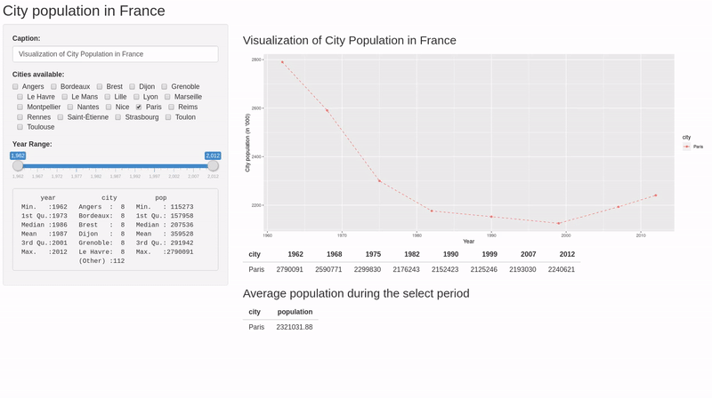
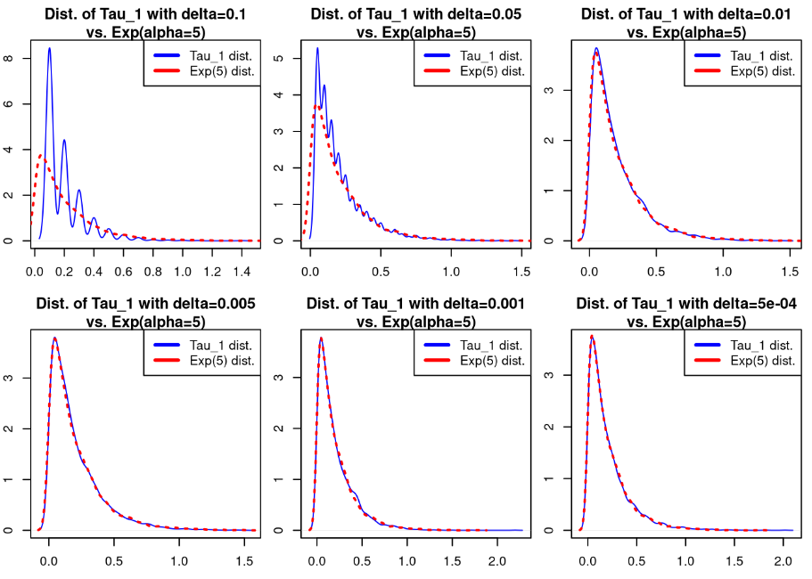
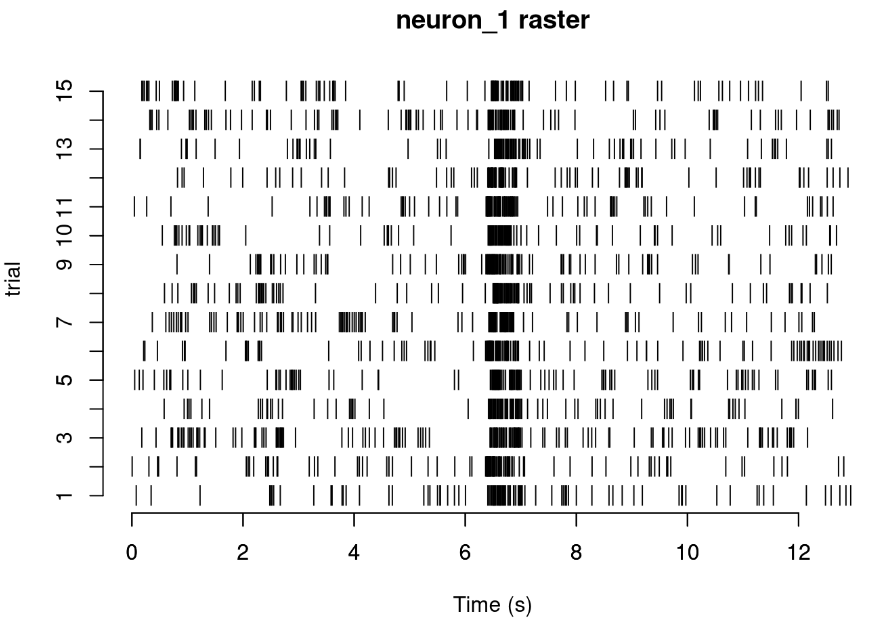
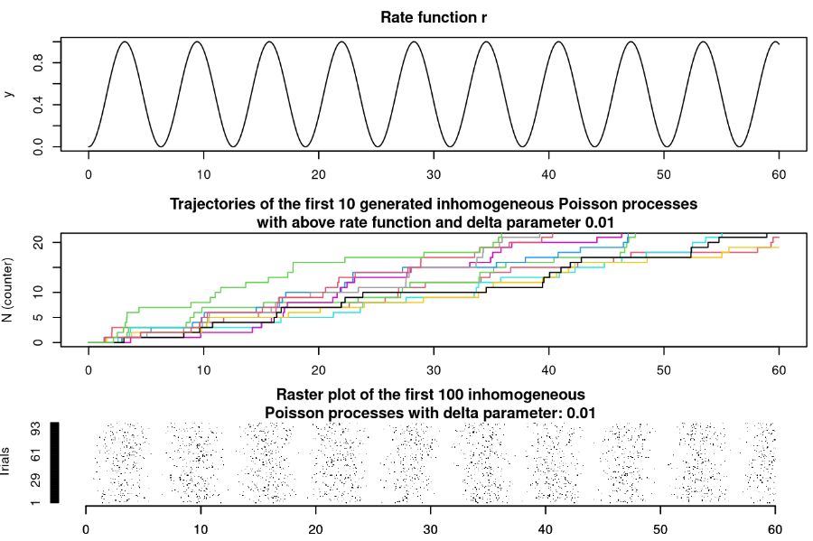

Repository or some .R files processing various datasets.

## Project 1 - Analysis of the R Diamonds dataset

R Markdown file offering a statistical overview of the R Diamonds dataset available in the Tidyverse library.

## Project 2 - Analysis of the R nycflights13 dataset

R Markdown file offering a statistical overview of the R nycflights13 dataset available in the library of the same name.

## Project 3 - Analysis of the population of large French cities

R Markdown/Shiny App file offering a statistical overview of the population of large French cities.

## Project 4 - Implementation of a linear model 

Implementation of a simple linear model to try and assess validity as well as perform variable selection.

## Project 5 - Fourier Regression

R Markdown file offering a demonstration of Fourier regression on a sinusoidal signal and a spike signal along with the use of BIC for model selection (of Fourier Coefficients). 

## Project 6 - Markov Chains and Markov Processes

R Markdown file offering a simple simulation of Markov Chains and their continuous counterpart: Markov Processes.

## Project 7 - Kernel Estimation with Cross-Validation and Bootstrapping (Interspike Interval modeling)

R Markdown file offering an overview of kernel estimator cross-validation, and non- and parametric bootstrapping methods in the context of interspike intervals. 

## Project 8 - Simulation of Poisson Processes (Interspike Interval modeling)

R Markdown file offering an overview of homogeneous and non-homogeneous Poisson Processes and their simulation using different algorithms. 

## Project 9 - Simulating Point Processes

R Markdown file offering a simulation of point processes, e.g. with a thinning process.

## Project 10 - Simulating PDMP

R Markdown file offering a simulation of a piecewise deterministic markov process.

#### License

MIT, see `LICENSE.txt`
